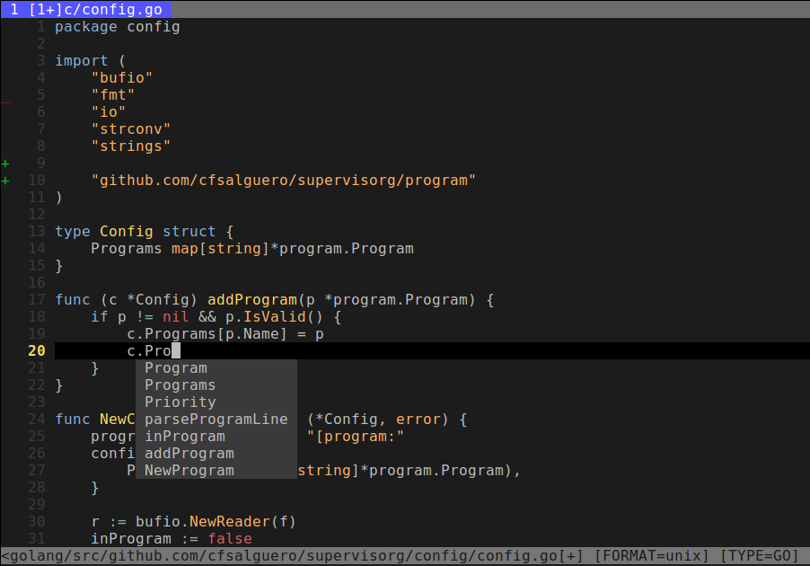
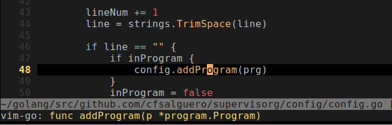

#My Vim config
  
##Install 
`git clone https://github.com/cfsalguero/vim_config.git ~/.vim`
`cd ~/.vim`
`./install.sh`

GitGutter at the left margin showing lines added/removed in the curren branch.  
Autocomplete (YouCompleteMe)  

Using GoInfo over the addProgram function call:  

